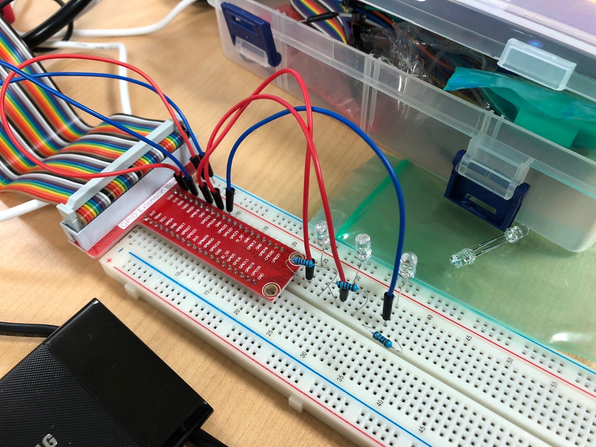

# Multi thread programming (2020-08-14)

## 3개의 led를 제어하는 응용프로그램
- 소스 코드 목록
1. led_main.c 
2. led.h : LED GPIO PIN 번호, 함수의 선언문, 라이브러리 파일들
3. led_green.c, led_yellow.c

- 라즈베리 확장 GPIO 핀에 LED 3개를 연결
(빨강: GPIO-18, 파랑: GPIO-23, 노랑: GPIO-24)

### <프로그램 실행 방법>
1. `$ make` : 오브젝트 파일과 실행파일(ledtest)가 만들어진다.
2. 원하는 옵션을 넣는다.
- `$ ./ledtest` 빨간색 LED만 1초 간격으로 10회 on/off 반복
- `$ ./ledtest 1 5` 빨간색 LED 1초 간격으로 10회 on/off 반복, 초록색 LED는 2초 간격으로 5회 on/off
- `$ ./ledtest 2 7` 빨간색 LED 1초 간격으로 10회 on/off 반복, 노란색 LED는 3초 간격으로 7회 on/off
- `$ ./ledtest 3 6` 빨간색 LED 1초 간격으로 10회 on/off 반복, 초록색 LED는 2초 간격으로 6회 on/off, 노란색 LED는 3초 간격으로 6회 on/off
- 지정된 숫자외에 다른 값을 입력할 시에 경고문과 함께 프로그램이 종료된다
3. `$ make clean` : make를 통해 만들어졌던 오브젝트 파일과 실행파일을 지울 수 있다.

## 스레드(thread)
- 프로세스 : 자기 자신만의 주소 공간을 갖는 독립적인 실행 프로그램
- 멀티 프로세스 : 두 개 이상의 프로세스가 실행되는 것
- 멀티 태스킹 : 두 개 이상의 프로세스를 실행하여 일을 처리하는 것
- 스레드 : 프로세스 내에서 실행되는 흐름의 단위

## 멀티 스레드
- 한 프로그램 내에서 두 개 이상의 스레드를 동시에 실행하는 것
- 공유 데이터에 대한 경쟁조건이 발생한다. -> 동기화 처리를 해줘야 함.
- 뮤텍스(Mutex) : 공유된 자원의 데이터를 여러 쓰레드가 접근하는 것을 막는 것

