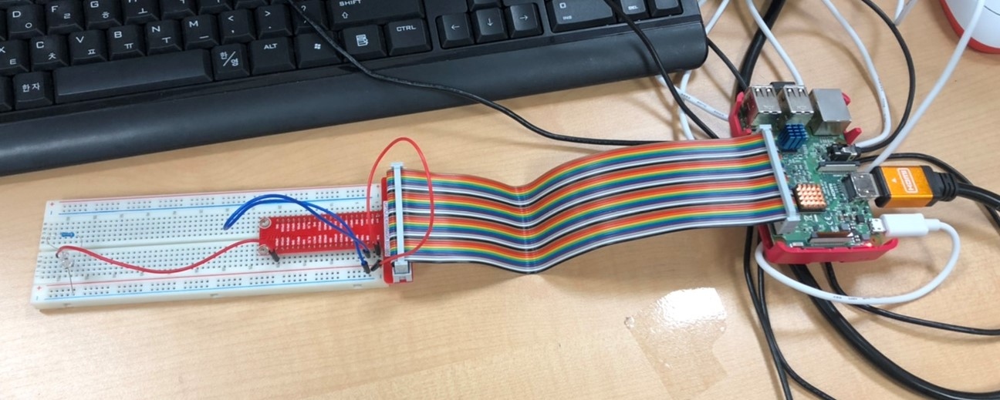
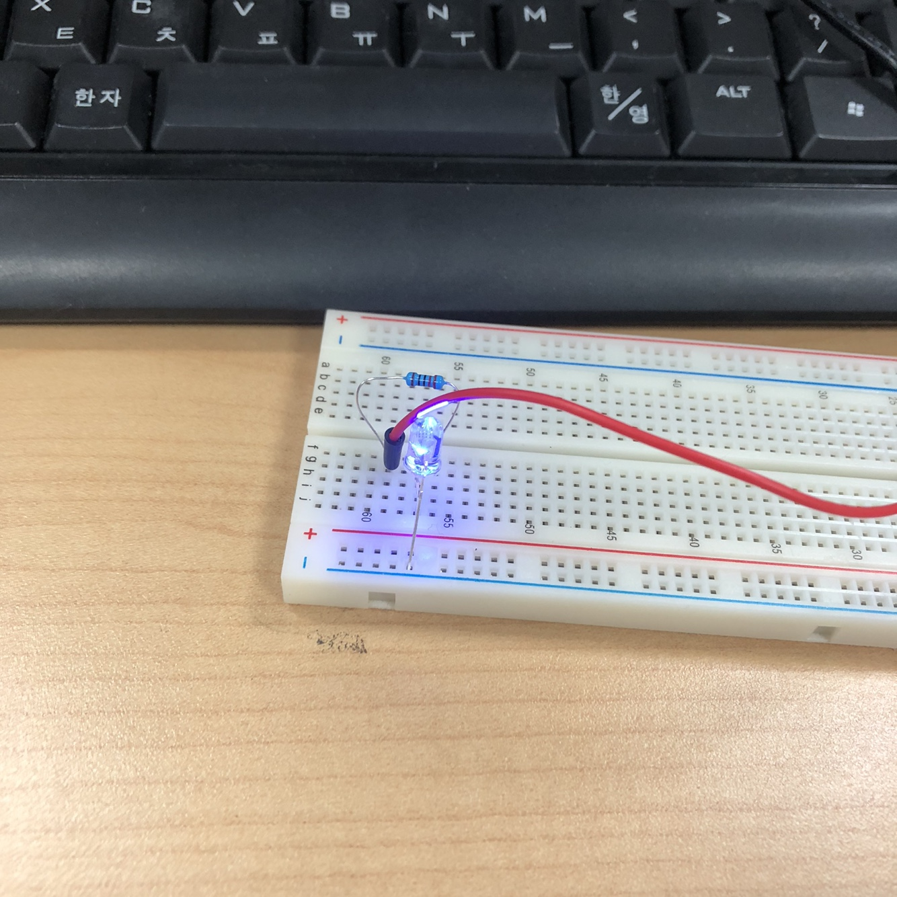

# LED CONTROL(2020.08.10)


<em>라즈베리파이와 GPIO를 연결한 모습</em>

##### 라즈베리파이의 GPIO(General Purpose Input Output)를 컨트롤할 수 있는 라이브러리인 wiringPi를 이용해  LED를 컨트롤


```
$ gpio readall
```
gpio핀의 상태를 모두 보여주는 명령어이다. 


```
$ gcc ledTest.c -lwiringPi
```
위의 명령어를 입력하면 실행파일이 생성된다.


```
$ ./a.out
```
생성된 실행파일을 실행시키면 5초동안 LED가 깜빡거린다.


