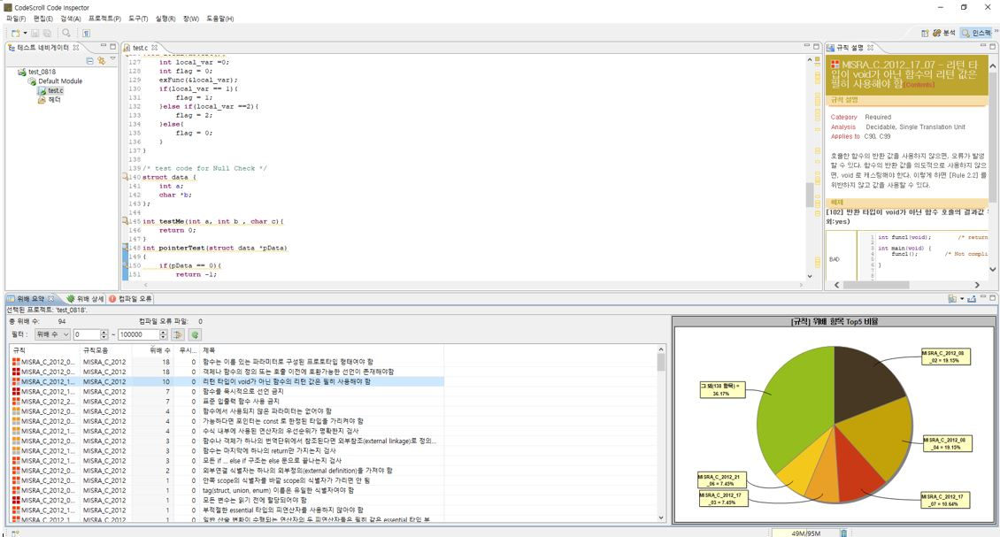
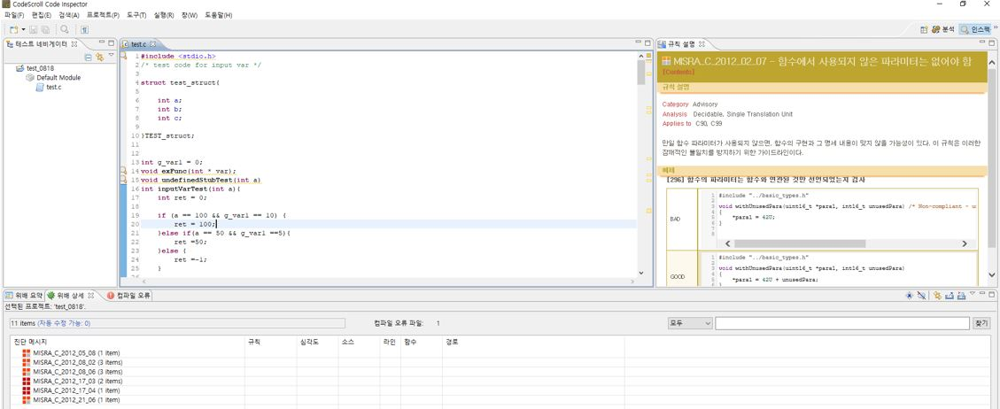
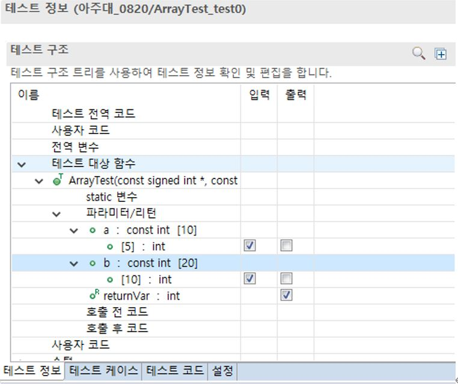
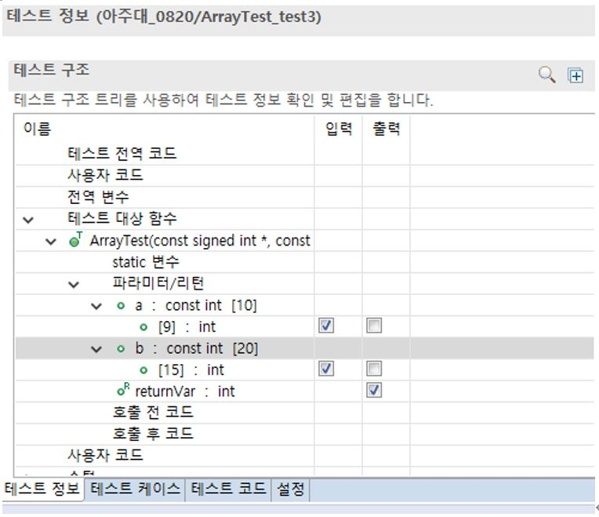
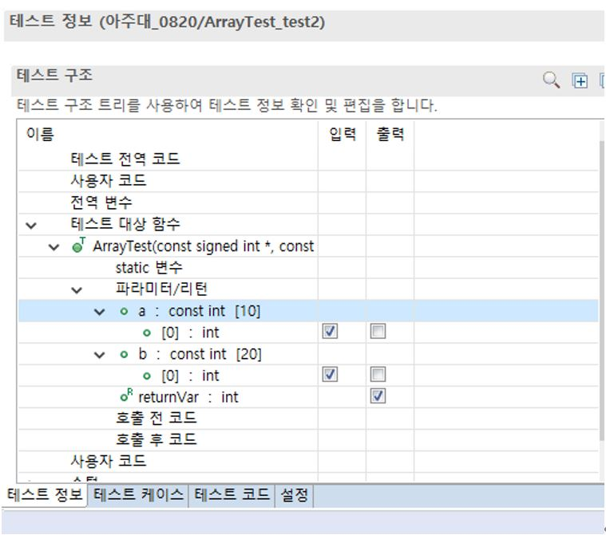
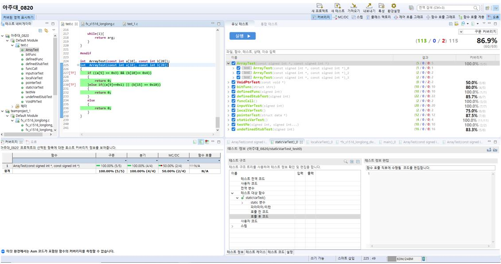
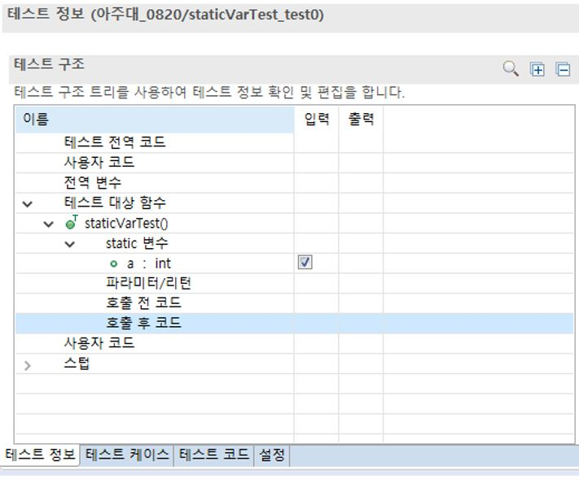
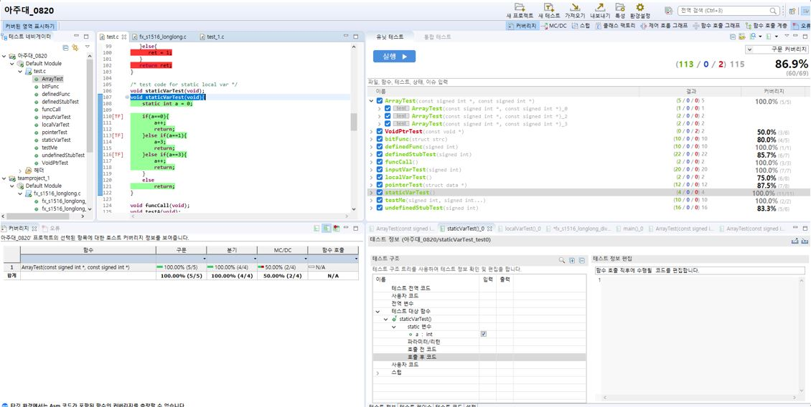

# SW TESTING(2020-08-18/19/20/21)

|   | Black-Box Testing | White-Box Testing|
|-------- |--------|--------|
| Static Testing         | Documentation Review  - Requirement Review - Specification Inspection    | Source code Review - Cyclomatic complexity - Static Analysis|
| Dynamic Testing        | Specification-based Testing - Integration Testing - System Testing   | Structural Testing - Statement coverage Testing - Branch coverage Testing  |

### 정적 테스트
- 소프트웨어를 실행하지 않고 결함을 검출하는 방법
- 코딩 규칙이 제대로 되었는지를 보는 것. 코딩의 기능적인 부분을 구현하는 것은 아니다.
- 테스트의 종료 기준을 명확하게 정하는게 필요하다.
- 어떤 테스트를 수행할 것인가를 설정해야 한다.

#### (2020-08-19 과제)
- Code Inspector 프로그램을 이용해서 MISRA_C_2012 규칙에 맞춰 test.c 파일을 테스트 해봄.

위배 사항 고치기 전 : 94개

위배 사항 고치기 후 : 32개

### 동적 테스트
- 개발된 프로그램을 실행하여 테스트를 하는 방법
- 실행하여 실제 발생하는 오류, 문제를 해결한다.

#### (2020-08-20 과제)
- test.c 파일의 ArrayTest와 StaticVarTest에 대해 구문, 분기 커버리지 100% 완성
- ArrayTest

- StaticVarTest

