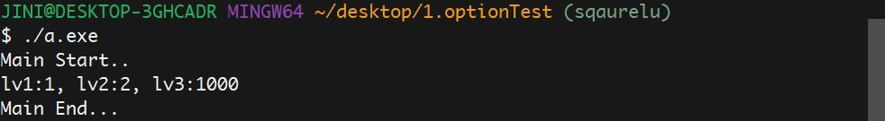
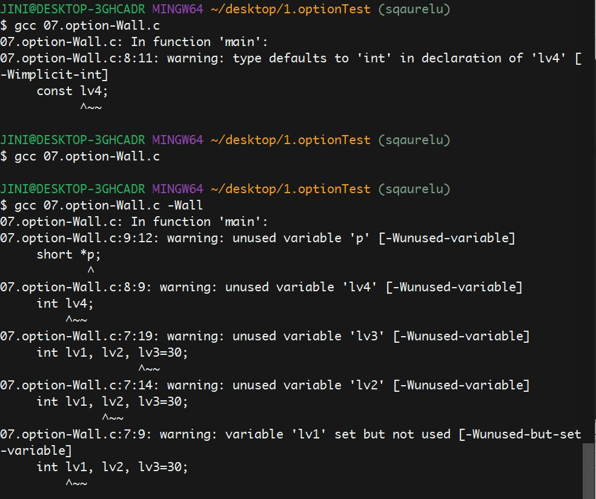

# three_func (2020.08.05)

Preprocessor(source code를 컴파일하기 전에 처리되는 부분)
- #define
- #include
- Conditional compilation: #if, #ifdef, #ifdef, #elif, #else, #endif

gcc 컴파일/ 옵션 
- gcc <filename> : a.exe 파일 생성
- gcc -c <filename> : 목적(object) 파일 생성
- gcc -D[macro] : 매크로를 외부에서 define할 때 사용
- gcc -U[macro] : 매크로를 외부에서 undefine할 때 사용

# (2020.08.06)

### compiler와 interpreter의 차이

컴파일러
- 소스 코드를 한 번에 번역한다.
- 번역시간이 오래 걸리지만 한번 번역을 한 후에는 목적파일이 생성되기 때문에 다음에 프로그램을 실행할 때는 시간이 줄어든다.
- 목적파일이 생성되기 때문에 메모리를 사용한다.

인터프리터
- 한줄씩 번역과 실행을 진행한다.
- 런타임에 해석을 해서 컴파일러보다 번역시간은 빠르지만, 실행시간이 오래 걸린다.
- 런타임에 실시간으로 Debugging 및 고드 수정이 가능하다.
- 목적파일을 생성하지 않아 메모리를 사용하지 않는다.

### 01. optionTest gcc로 컴파일해보기

- `$ gcc -E 01.option-E.c > 01.option-E.i`
-E 옵션을 사용해 .c 파일을 .i로 바꾸는 과정(전처리)

- `$ gcc -S 01.option-E.i`
-S 옵션을 사용해 전처리된 코드를 어셈블리 코드로 바꿔주는 과정

- `$ gcc -c 01.option-E.s`
-c 옵션을 사용해 목적(object)파일을 생성한다

- `$ gcc 01.option-E.o`
생성된 목적(object)파일을 gcc 명령을 통해 실행 파일 생성

- `$ gcc 07.option-Wall.c` 
-Wall 옵션을 사용해 모든 warning message를 볼 수 있다

- `$ gcc -g 06.option-g.c` 
-g 옵션을 사용해 바이너리 파일에 디버깅 정보를 삽입한다

- `gcc 01.option-E.c -o file` 
-o 옵션을 사용해 출력할 파일을 정할 수 있다

- `$ gcc 01.option-E.c -I file` 
-I 옵션을 사용해 헤더파일을 탐색할 디렉토리를 지정할 수 있다

- `$ gcc 08.option-l.c -l pthread` 
-l 옵션을 사용해 필요한 라이브러리를 링크

# Make Makefile(2020.08.07)

- `touch <filename>` 의 기능
1. 비어있는 껍데기 파일을 만든다.  
2. 파일이 존재할 때는 수정 시간을 바꾼다.  

## <Make 유틸리티> : 컴파일을 자동화 해주는 명령어 생성 프로그램

### Makefile 형식
- target: dependency(pre-requirement)  
&ensp;&ensp;&ensp;&ensp;&ensp;&ensp;&ensp;&ensp;command  
target을 만들 때 사용하는 명령어는 반드시 tab키로 들여쓰기를 한 후 써야한다.

### 내장 매크로
- $@: 현재 목표 파일명
- $?: 현재 목표 파일보다 더 최근에 갱신된 의존 파일 명단
- $*: 현재 목표 파일보다 더 최근에 갱신된 의존 파일 명단(확장자 제외)
- $<: 의존 파일 중 첫번째 파일명
- $^: 현재 모든 의존 파일들의 명단
- CC: C 프로그램을 컴파일 하기 위한 프로그램, 초기값은 cc 
- CFLAGS: cc 명령어의 옵션 설정

### 확장자 규칙
- .c.o:  
&ensp;&ensp;&ensp;$(CC) -c $(CFLAGS) $<  
확장자 규칙(.c 파일들을 .o 파일로 만든다.)
- (OBJS) := $(SRCS:.c=.o)  
확장자의 치환(.c 파일들을 .o 파일로 만든다.)

# LED CONTROL(2020.08.10)

`gcc ledTest.c -lwiringPi`

